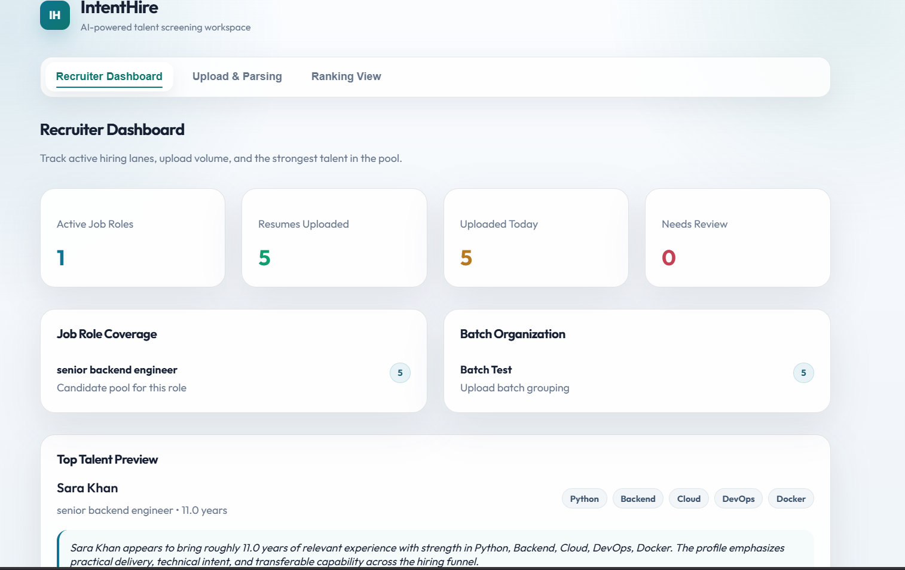
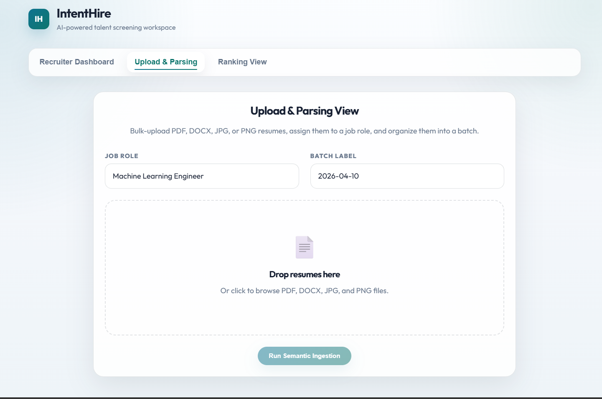
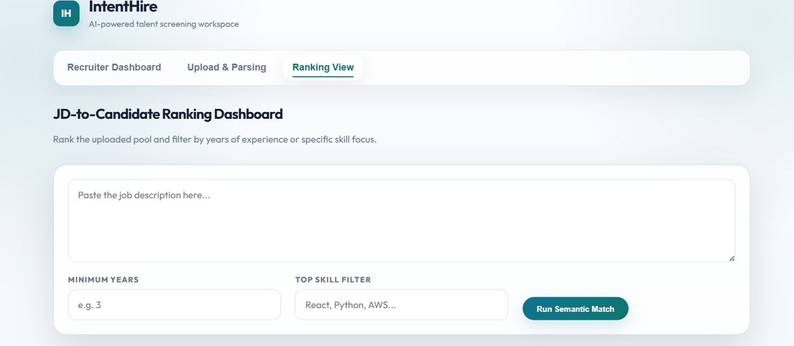
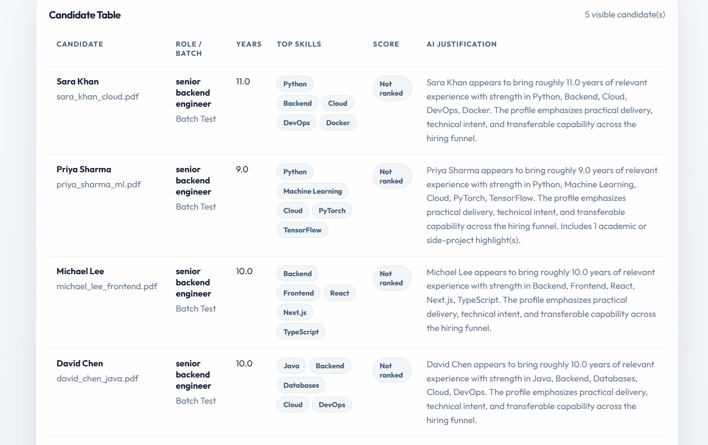

# IntentHire

### AI-powered recruitment platform for resume parsing, candidate scoring, and semantic ranking

[](https://github.com/athul-dev-sys/IntentHire)
[](https://nextjs.org/)
[](https://fastapi.tiangolo.com/)
[](https://ai.google.dev/)
[](https://www.pinecone.io/)

IntentHire is an AI-powered hiring workflow platform that helps recruiters parse resumes, understand candidate intent, and rank applicants against job descriptions using semantic matching instead of traditional keyword-based filtering.

Repository: [https://github.com/athul-dev-sys/IntentHire](https://github.com/athul-dev-sys/IntentHire)

---

## Problem Statement

Recruiters often receive hundreds or thousands of resumes for a single job posting. Traditional Applicant Tracking Systems rely heavily on keyword matching, which can reject strong candidates simply because they use different terminology.

IntentHire focuses on meaning, skills, experience depth, and candidate intent so recruiters can identify stronger matches faster and reduce manual screening fatigue.

---

## Solution Overview

IntentHire provides an end-to-end recruitment screening workflow:

```text
Upload Resumes
      ↓
Resume Parsing
      ↓
AI / Semantic Profile Extraction
      ↓
Structured Candidate Storage
      ↓
Semantic Ranking
      ↓
Recruiter Dashboard + Ranked Results
```

The platform allows recruiters to upload resumes, organize candidates by job role and batch, extract structured candidate profiles, and rank them against a job description using semantic similarity and experience-based scoring.

---

## Features

- 📄 **Multi-format Resume Upload**: Supports PDF, DOCX, JPG, and PNG resumes.
- 🧠 **AI-powered Resume Understanding**: Extracts skills, experience, certifications, and profile summaries.
- 🎯 **JD-to-Candidate Ranking**: Scores candidates against a job description using semantic alignment and experience depth.
- 📊 **Recruiter Dashboard**: Displays active roles, resume counts, batch grouping, and top talent preview.
- 🗂️ **Batch and Job Role Organization**: Groups uploaded resumes by job role and batch label.
- 💬 **AI-style Justification**: Explains why each candidate matches the job description.
- 🖼️ **Image Resume OCR**: Parses image-based resumes with local OCR support.
- ⚙️ **End-to-End Workflow**: Covers upload, parsing, storage, ranking, and recruiter-facing results.

---

## Tech Stack

| Layer | Technologies |
|---|---|
| Frontend | Next.js, React, TypeScript, CSS |
| Backend | FastAPI, Python |
| Database | SQLite, SQLAlchemy |
| AI / LLM | Google Gemini GenAI |
| Vector Search | Pinecone |
| Resume Parsing | PyMuPDF, DOCX XML parsing |
| Image OCR | RapidOCR / ONNX Runtime |
| API Communication | REST APIs |

---

## System Architecture

```text
+-------------------------+
|      Recruiter UI       |
|  Next.js + React + TS   |
+-----------+-------------+
            |
            | REST API
            v
+-------------------------+
|      FastAPI Backend    |
| Upload, Parse, Rank API |
+-----------+-------------+
            |
            v
+-------------------------+
|   Resume Parsing Layer  |
| PDF / DOCX / Image OCR  |
+-----------+-------------+
            |
            v
+-------------------------+
| Semantic Profile Engine |
| Skills, Experience, Fit |
+-----------+-------------+
            |
            v
+-------------------------+
|   Structured Storage    |
| SQLite + SQLAlchemy     |
+-----------+-------------+
            |
            v
+-------------------------+
| Semantic Ranking Layer  |
| Gemini + Pinecone Ready |
+-----------+-------------+
            |
            v
+-------------------------+
| Ranked Candidate Output |
| Score + Justification   |
+-------------------------+
```

---

## Setup Instructions

### 1. Clone the Repository

```bash
git clone https://github.com/athul-dev-sys/IntentHire.git
cd IntentHire
```

### 2. Backend Setup

```bash
cd backend
python -m venv .venv
```

Activate the virtual environment.

Windows PowerShell:

```powershell
.\.venv\Scripts\Activate.ps1
```

macOS/Linux:

```bash
source .venv/bin/activate
```

Install dependencies:

```bash
pip install -r requirements.txt
```

Run the FastAPI server:

```bash
python -m uvicorn app.main:app --reload --host 127.0.0.1 --port 8000
```

Backend URL:

```text
http://127.0.0.1:8000
```

### 3. Frontend Setup

Open a new terminal from the repository root:

```bash
npm install
npm run dev
```

Frontend URL:

```text
http://localhost:3000
```

### 4. Optional AI Configuration

Create a `.env` file inside the `backend` folder if using live AI/vector integrations:

```env
GEMINI_API_KEY=your_google_gemini_api_key
PINECONE_API_KEY=your_pinecone_api_key
```

The app can still run locally as a functional prototype without external API keys.

---

## Demo Data

Sample resumes and a sample job description are included for quick testing:

```text
test-data/
├── alex_johnson_backend.pdf
├── david_chen_java.pdf
├── michael_lee_frontend.pdf
├── priya_sharma_ml.pdf
├── sara_khan_cloud.pdf
└── sample_jd_backend.txt
```

Suggested demo JD:

```text
Senior Backend Engineer with 3+ years Python FastAPI AWS Docker SQL experience
```

---

## API Endpoints

| Method | Endpoint | Description |
|---|---|---|
| `GET` | `/` | Health check / welcome route |
| `GET` | `/api/dashboard` | Returns recruiter dashboard metrics |
| `GET` | `/api/candidates` | Returns stored candidate profiles |
| `POST` | `/api/upload` | Uploads and parses resumes |
| `POST` | `/api/rank` | Ranks candidates against a job description |

Example ranking request:

```json
{
  "jd_text": "Senior Backend Engineer with 3+ years Python FastAPI AWS Docker SQL experience",
  "top_k": 10
}
```

---

## Demo Video

Watch the project demo here:

[https://www.youtube.com/watch?v=de5UdZCQsVM](https://www.youtube.com/watch?v=de5UdZCQsVM)

---

## Screenshots

### Recruiter Dashboard



### Upload & Parsing View



### Ranking View



### Candidate Results



---

## Key Highlights

- Built as a practical AI recruitment workflow, not just a static UI demo.
- Supports multiple resume formats including PDF, DOCX, JPG, and PNG.
- Uses semantic matching concepts instead of simple keyword filtering.
- Includes recruiter dashboard analytics for visibility into hiring batches.
- Provides ranked candidates with compatibility scores and AI-style justification.
- Separates frontend, backend, parsing, storage, and ranking logic cleanly.
- Can run locally for demo/testing while remaining extensible for Gemini and Pinecone integrations.

---

## Future Improvements

- Add production-grade vector search using Pinecone for all candidate profiles.
- Improve LLM-based extraction with stricter schema validation and confidence scores.
- Add authentication and recruiter workspace management.
- Add candidate deduplication and resume versioning.
- Improve scanned-PDF handling for noisy real-world resumes.
- Add advanced filters for location, salary, notice period, and domain experience.
- Deploy frontend and backend to cloud infrastructure.
- Add automated test coverage for parsing, ranking, and API endpoints.

---

## Author

**Athul Sunil Kumar**

- Email: athulsunilkumar6@gmail.com
- GitHub: [athul-dev-sys](https://github.com/athul-dev-sys)
- Project Repository: [IntentHire](https://github.com/athul-dev-sys/IntentHire)
